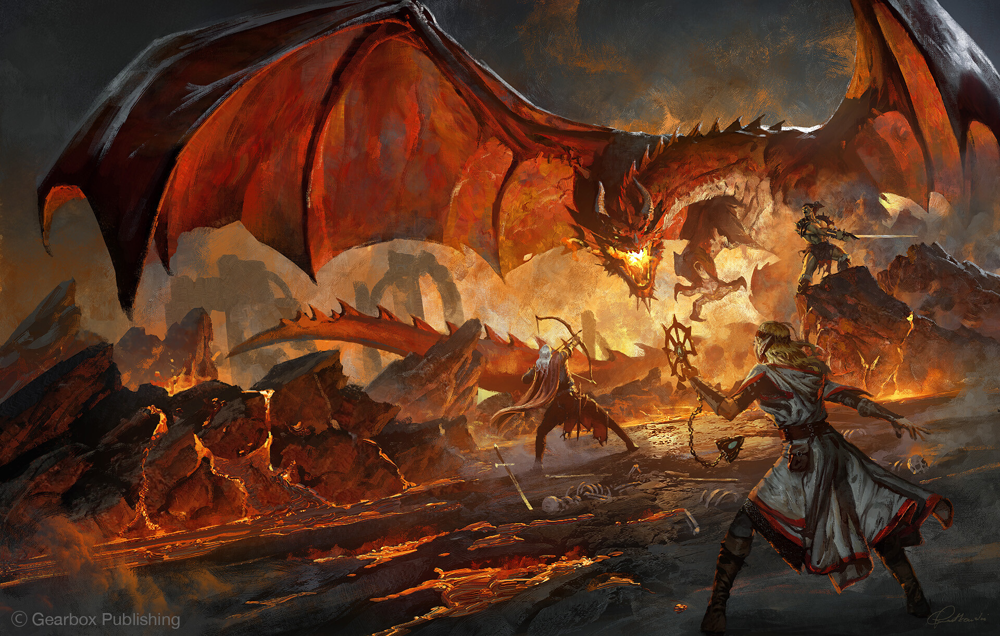
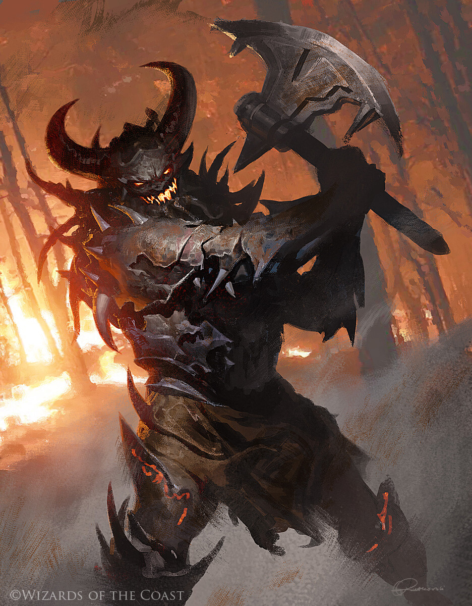
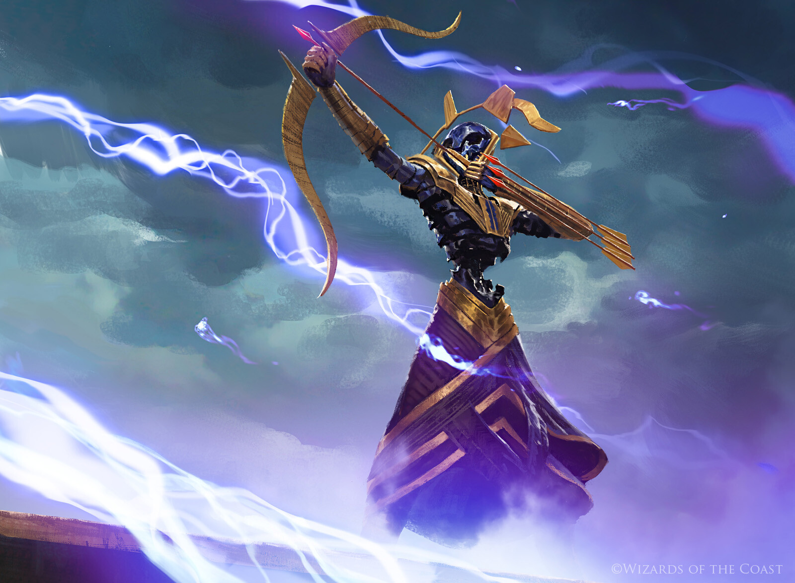
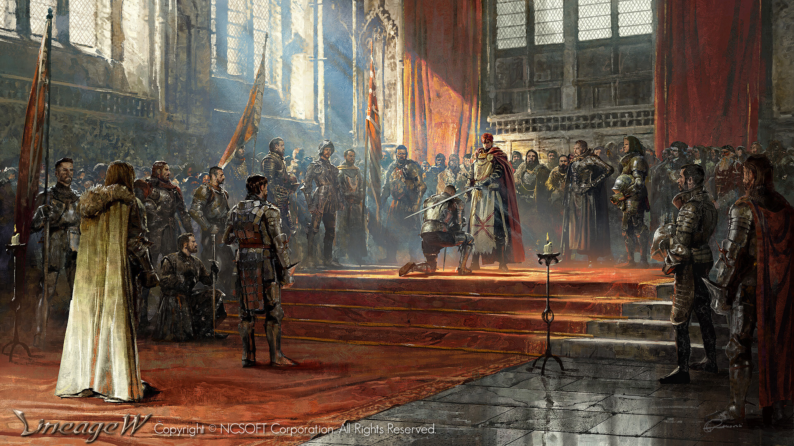
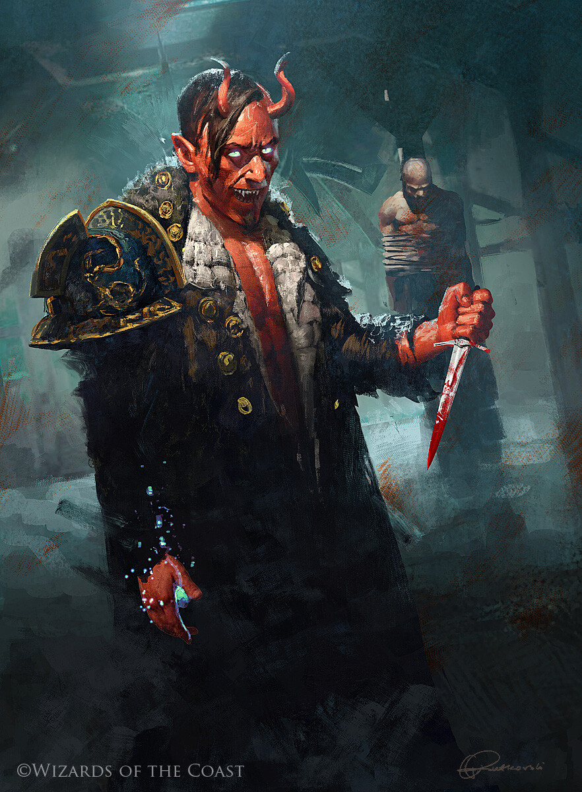
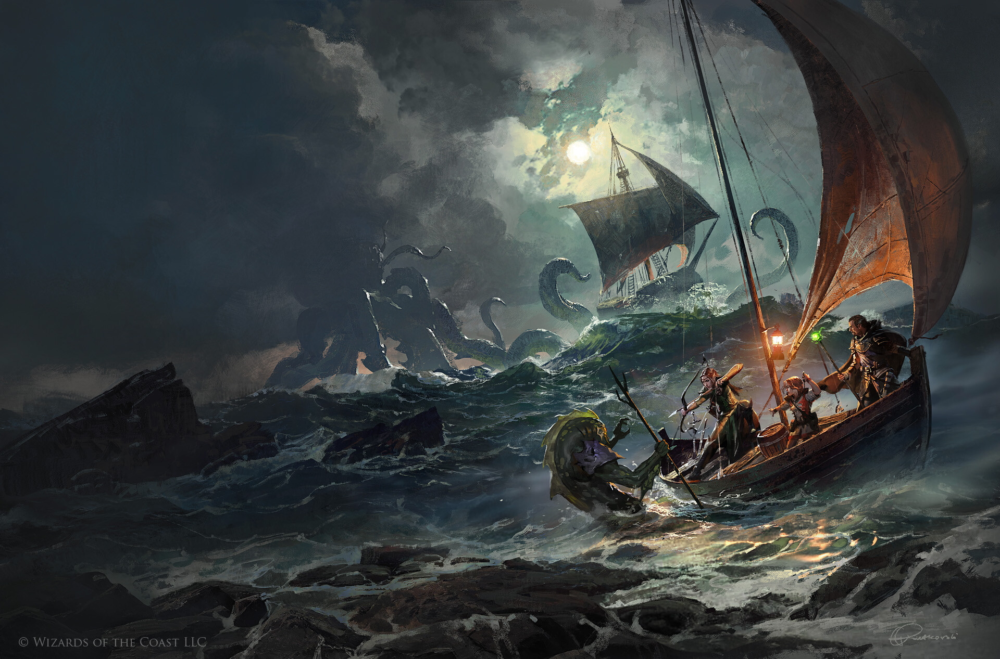

## The question

When a generative model learns to paint like a specific artist, is it forging their work? The word is loaded, but the phenomenon is real. Models trained on an artist's images can reproduce their visual style on demand, without credit, consent, or compensation. The impact on working artists is visible. What is less clear is what can be established — technically or legally — and how far those two things diverge.

Copyright infringement requires two things: *access* (the defendant had the opportunity to copy the work) and *substantial similarity* (something protected was actually reproduced). Style, technique, and aesthetic are explicitly excluded from protection under Section 102(b) of the US Copyright Act. So the legal question is not whether a model was trained on an artist's work, but whether that training produced something that copies it in a legally cognizable way.

This post works through that question using Greg Rutkowski as a case study, moving across three levels of access:

- **The training data.** If the dataset is public, you can search it directly.
- **The model weights.** If the model is open-weight, you can probe its internals.
- **The model outputs.** Even without weights, you can generate images and measure them.

At each level, we ask not just what the technical evidence shows, but what it can actually establish legally. The two questions have different answers — and their divergence is the point. We close by asking what this means for the commercial models artists encounter today.

---

## Greg Rutkowski

Greg Rutkowski is a Polish digital artist whose paintings hang in the portfolios of Dungeons and Dragons, Magic: The Gathering, Sony, and Ubisoft. His work is immediately recognizable: dramatic side-lighting, rich ochre and crimson palettes, and a classical oil-painting texture applied to fantastical subjects.

```{=html}
<div class="portfolio-grid">
  <div class="portfolio-grid-item"></div>
  <div class="portfolio-grid-item"></div>
  <div class="portfolio-grid-item"></div>
  <div class="portfolio-grid-item"></div>
  <div class="portfolio-grid-item"></div>
  <div class="portfolio-grid-item"></div>
</div>
<p class="portfolio-grid-caption">Six works from Greg Rutkowski's portfolio.</p>
```

In 2022, users of Stable Diffusion discovered that appending "by Greg Rutkowski" to any prompt reliably upgraded the output. The phrase became more common in SD prompts than "by Picasso" or "by Da Vinci." His name appeared in more than 93,000 public prompts in a single month. He learned about this from journalists, not from Stability AI.

He is now a named plaintiff in [*Andersen v. Stability AI*](https://www.courtlistener.com/docket/66732129/andersen-v-stability-ai-ltd/) (N.D. Cal. 3:23-cv-00201), a class action alleging that Stability AI trained its models on billions of scraped images without consent. In November 2025, the UK High Court ruled in [*Getty Images v. Stability AI*](https://www.bailii.org/ew/cases/EWHC/Ch/2025/2863.html) that "the Model itself does not store any of those Copyright Works," narrowing but not ending the debate.

His case is well-suited to this investigation. His work is confirmed in LAION-5B, the training dataset for Stable Diffusion 1.x. Stability AI reportedly removed him from SD 2.1's training data. And his ongoing lawsuit makes the evidentiary question legally consequential, not merely academic.

---

## Level 1: The training data

The most direct question is also the easiest: is the artist's work actually in the training data?

LAION-5B is a public index of 5.85 billion image-text pairs scraped from the web, and the training data for Stable Diffusion 1.x. It stores URL metadata and CLIP embeddings for each image — not the images themselves. The intended way to search it is by embedding: compute a CLIP ViT-L/14 embedding for a portfolio image, query the LAION knn index, and retrieve nearest neighbors by cosine similarity. A match above 0.95 cosine similarity means the image, or a near-duplicate, was in the training data at collection time. This is exact enough to say with confidence whether a specific painting was scraped.

In practice, running this search today is no longer possible. LAION stores only URLs, and the web has moved on: by 2026, a large fraction of those URLs return 404s or have been actively taken down, in part because of the litigation. The retrieval service that hosted the knn index (knn.laion.ai) is also offline. What remains is metadata — captions, URLs, embeddings — without the images they pointed to.

Rutkowski's presence in LAION-5B is not in dispute. It is documented in the lawsuit record, confirmed by the [Somepalli et al. (2024)](https://arxiv.org/abs/2404.01292) study, and acknowledged by Stability AI. His name appeared in an estimated 93,000 publicly shared prompts in a single month in 2022, a figure that traces back to images scraped and captioned under his name. The infrastructure to verify this independently is no longer accessible, but the fact itself is established.

This establishes **access** in the copyright sense: the defendant had the opportunity to copy the work. Whether that access translates into a detectable signal inside the trained model is a harder question — and the one we turn to next.

---

## Level 2: The model weights

Since SD 1.5 is open-weight, we can load it and inspect its internal behavior. One legal theory holds that this is where the infringement lies: that the model's weights are not merely a tool trained on copyrighted works but are themselves an encoding of those works — a compressed, implicit copy of everything the model saw during training. Under this view, distributing the weights is distributing an infringing derivative. The question is whether that claim can be technically substantiated.

The standard approach is **loss-based membership inference**, developed for diffusion models by [Matsumoto et al. (IEEE S&P Workshops 2023)](https://arxiv.org/abs/2302.03262). Diffusion models are trained to predict the noise added to an image at each timestep:

$$\mathcal{L}(\theta) = \mathbb{E}_{t,\, x_0,\, \epsilon \sim \mathcal{N}(0,I)} \left[ \bigl\| \epsilon - \epsilon_\theta(x_t,\, t) \bigr\|^2 \right]$$

If the model trained on an image, it should denoise it more accurately, producing lower prediction error. We measure that error across six timesteps for each portfolio image and use the mean as a membership score. The control group is **Charlie Bowater**, a UK-based fantasy illustrator working in a comparable genre. We use images published after LAION-5B's collection cutoff, ensuring they cannot appear in the training data. If Rutkowski is a training member, his images should have lower loss than Bowater's — the model should denoise what it has seen before.

```{=html}
<script src="https://cdn.plot.ly/plotly-2.26.0.min.js"></script>
<div class="plotly-wrap">
  <div id="fig2a"></div>
  <p class="fig-caption"><strong>Figure 2a.</strong> Mean prediction MSE vs. timestep for Rutkowski (red) and Bowater (blue) on SD 1.5 (left) and SD 2.1 (right). Each panel has its own y-axis; the models are not directly comparable across panels. Shaded bands show ±1 SD.</p>
</div>
<script>
function loadPlotly(id, jsonPath, overrides) {
  fetch(jsonPath).then(r => r.json()).then(fig => {
    const layout = Object.assign({}, fig.layout, {
      title: '',
      autosize: true,
      hovermode: false,
      margin: {t: 20, b: 60, l: 60, r: 20},
      font: {family: 'Georgia, serif', size: 12},
      paper_bgcolor: 'white', plot_bgcolor: 'white',
      legend: {orientation: 'h', y: -0.22, font: {size: 11}},
    }, overrides || {});
    Plotly.newPlot(id, fig.data, layout, {responsive: true, displayModeBar: false});
  });
}
loadPlotly('fig2a', 'assets/figures/fig2a_mia_loss_curves.json', {height: 300});
</script>
```

The result is close to chance. On SD 1.5, Rutkowski's mean loss is 0.277 and Bowater's is 0.246 — a gap of −0.031, meaning Rutkowski actually has *higher* loss than the control. The wrong direction, and a difference small enough to attribute to noise.

This is not a failure of experimental design; it is the expected finding at this scale. [Dubinski et al. (WACV 2024)](https://arxiv.org/abs/2306.12983) systematically evaluated all standard membership inference attacks on diffusion models trained on LAION-scale data and found that every attack performs near chance. The model has seen five billion images; whatever trace any single painting leaves in the weights is swamped by everything else. [Das et al. (ICML 2024)](https://arxiv.org/abs/2406.16201) showed that earlier apparent successes in membership inference relied on comparing groups with systematically different statistical properties — not genuine membership signal.

The null result does not disprove the legal theory that the weights constitute an infringing copy. It shows that the theory cannot be verified with any available technical tool. Even if every Rutkowski painting left some residue in the model's parameters, that residue is undetectable at LAION scale. The claim may be true; it remains technically unprovable.

---

## Level 3: The model outputs

Since the weights offer no detectable signal, we turn to the outputs. The question now is closer to what copyright law actually cares about: does the model produce images that are substantially similar to the originals? This is the test that matters — not whether training data was used, but whether something protected was reproduced.

We run two experiments. The first uses content similarity as a proxy for substantial similarity. The second isolates style.

### Name as content cue

We use BLIP, an image captioning model, to generate a content description for each of 30 Rutkowski portfolio images — something like "a painting of a knight in shining armor." We then generate two images from SD 1.5: one from the raw caption, one with ", by Greg Rutkowski" appended. The question is whether adding the name produces images that are substantially similar to the originals.

To measure this, we use CLIP ViT-L/14 cosine similarity. CLIP is primarily content-sensitive — it responds to subject matter more than visual style — making it a reasonable proxy for the kind of similarity a court might evaluate when comparing specific works.

{width=100% fig-alt="Figure 3a"}

::: {.fig-caption-block}
**Figure 3a.** Original paintings (left), SD 1.5 generation from the BLIP caption alone (center), and generation from the same caption with ", by Greg Rutkowski" appended (right).
:::

Across 30 images, mean CLIP similarity increases from 0.704 (caption only) to 0.777 (caption + name), a gap of +0.073. The shift is real but modest, and the absolute values tell the more important story: even with the name, the generated images sit far below the similarity scores you would expect between two versions of the same work. The model is producing new paintings of related subjects — not reproductions. Adding the artist's name changes the output, but not in a way that approaches substantial similarity to any specific original.

```{=html}
<div class="plotly-wrap" style="max-width: 420px; margin: 2rem auto 0;">
  <div id="fig3a_bar"></div>
</div>
<p class="fig-caption"><strong>Figure 3b.</strong> Mean CLIP similarity to the original across 30 images, with and without the artist name. Error bars show ±1 SD.</p>
<script>
loadPlotly('fig3a_bar', 'assets/figures/fig3a_clip_barchart.json', {
  height: 260,
  yaxis: {range: [0, 0.85], title: 'CLIP cosine similarity', tickfont: {size: 11}},
  showlegend: false,
  bargap: 0.5,
  margin: {t: 20, b: 50, l: 70, r: 70},
});
</script>
```

### Name as style trigger

The CLIP result rules out substantial similarity to specific works. But it leaves open a different question: is the model copying the *style*? CLIP conflates content and style, so a low score could mean either that the style wasn't reproduced or simply that the subject matter differs. To isolate the style signal, we need a different tool.

We write 10 standardized prompts beginning with "a painting of" and generate 3 images per prompt from SD 1.5, with and without ", by Greg Rutkowski" appended — 30 paired comparisons between the baseline and the named condition. The measurement tool is **CSD (Content and Style Disentangled)**, introduced by [Somepalli et al. (2024)](https://arxiv.org/abs/2404.01292). CSD is a ViT-L/14 model fine-tuned on LAION-Styles to separate content from visual style: high CSD similarity means two images share the same visual language regardless of what they depict. We compute a prototype style vector from the 30 Rutkowski portfolio images and measure each generated image's cosine distance to that prototype — the **General Style Similarity (GSS)**.

{width=100% fig-alt="Figure 3c"}

::: {.fig-caption-block}
**Figure 3c.** Caption only (top row) vs. caption + "by Greg Rutkowski" (bottom row). Three prompts shown left to right: knight in armor, dragon breathing fire, warrior on a battlefield.
:::

```{=html}
<div class="plotly-wrap" style="max-width: 420px; margin: 2rem auto 0;">
  <div id="fig3d"></div>
</div>
<p class="fig-caption"><strong>Figure 3d.</strong> Mean CSD style similarity (GSS) to the Rutkowski prototype across 30 generated images (10 prompts × 3 seeds), with and without the artist name. Error bars show ±1 SD.</p>
<script>
loadPlotly('fig3d', 'assets/figures/fig3d_gss_barchart.json', {
  height: 260,
  yaxis: {range: [0, 0.65], title: 'GSS (CSD cosine similarity)', tickfont: {size: 11}},
  showlegend: false,
  bargap: 0.5,
  margin: {t: 20, b: 50, l: 70, r: 70},
});
</script>
```

The effect is large. Without the name, GSS averages 0.249 — the model produces competent fantasy paintings with no particular stylistic signature. With the name, GSS rises to 0.530, more than doubling. Four words added to a prompt nearly double the style fidelity of the output.

This is the clearest signal in the investigation. The model did not merely memorize Rutkowski's images — it learned a mapping from his name to a coherent visual style. The name now functions as a style key: you do not need to know what his paintings look like, only who painted them.

Our prototype vector is built from 30 portfolio images, which is a relatively small sample. Somepalli et al., working with a larger reference collection and explicit "in the style of" prompts, report GSS = 0.85 for Rutkowski on SD 1.4. Our more conservative setup — content-based prompts, smaller prototype — still produces a gap of +0.281. The effect is robust.

The legal catch is immediate. Style is not copyrightable. Section 102(b) of the US Copyright Act explicitly excludes "style or technique" from protection. A GSS of 0.530 does not establish infringement, no matter how technically clear the signal is.

There is one further angle worth noting. Copyright's fair use doctrine (§107) weighs, as its fourth factor, "the effect of the use upon the potential market for or value of the copyrighted work" — a factor courts have described as the most important of the four. The argument here is not about specific copying: it is that a model capable of generating on-demand Rutkowski-style work at scale substitutes for the commercial demand that would otherwise reach him. His niche — fantasy illustration for trading card games, video game publishers, and licensed properties — is precisely the kind of high-volume, style-consistent work where AI substitution is most direct and measurable. If Stability AI argues fair use in *Andersen*, market harm is where the legal weight will fall.

This is the central inversion of the investigation. The technical signal is strongest — and the legal protection weakest — at exactly the same point.

---

## The practical question: commercial models

The three levels above are an investigation of one specific open model. SD 1.5 was trained on LAION-5B in 2022 and its weights are public. What that model can do with Rutkowski's name is documented. What it means legally is contested. But there is a separate practical question that matters just as much to the artist: can someone sitting at a keyboard today, using the commercial models that have replaced open diffusion systems in most workflows, replicate his style on demand? And are those models trying to prevent it?

The Level 3 results make the question sharper. We know that style-key encoding is real and detectable. The question is whether commercial providers — through training choices, content policies, or name-based filters — have changed this picture, and whether any filtering that exists actually blocks style replication or merely blocks attribution.

We test four models: **Gemini** (Google), **DALL-E 3** (OpenAI), **Midjourney**, and **Adobe Firefly**. Firefly is a meaningful addition: Adobe explicitly states it is trained only on licensed and public domain content, making it a potential negative control for style replication.

For each model, we run three kinds of experiments.

**Named style generation.** We ask directly for "a painting in the style of Greg Rutkowski." This is the most obvious test, and also the easiest for a provider to block. We document whether the model complies, refuses, adds a disclaimer, or silently modifies the output.

**Descriptive style generation.** We describe Rutkowski's visual characteristics without naming him: dramatic side-lighting, rich warm palette, painterly texture applied to fantastical subjects. This bypasses name-based filters. If the model still produces stylistically similar outputs, the style is encoded in the weights independent of name recognition.

**Zero-shot style transfer.** We upload one of Rutkowski's paintings and ask the model to generate a new image "in the style of this image," with no text attribution at all. The model receives the visual pattern as direct input and is asked to replicate it. This bypasses name-based filtering entirely: the model has no way of knowing whose work it is being shown.

::: {.callout-warning appearance="minimal"}
**Awaiting manual experiments.** Run the three experiment types across all four models. See the notebook Section 5 for the full protocol. Save outputs to `assets/frontier/`.
:::

::: {.fig-placeholder}
**Figure 5a.** Named style generation across four models: what each produces (or refuses to produce) for "a painting in the style of Greg Rutkowski." Refusal text reproduced verbatim where applicable.
*Collect outputs manually and add to `assets/frontier/named/`.*
:::

::: {.fig-placeholder}
**Figure 5b.** Descriptive style generation across four models: outputs for the style description with no artist name. CSD similarity to Rutkowski's prototype annotated.
*Collect outputs manually and add to `assets/frontier/descriptive/`.*
:::

::: {.fig-placeholder}
**Figure 5c.** Zero-shot style transfer: outputs from each model given a Rutkowski painting as a visual reference. CSD similarity to his prototype annotated.
*Collect outputs manually and add to `assets/frontier/transfer/`.*
:::

::: {.fig-placeholder}
**Figure 5d.** CSD style similarity across all conditions (named, descriptive, zero-shot) and all models.
*Generate with notebook Section 5 after collecting all outputs.*
:::

**Refusal and behavior log:**

| Model | Experiment | Behavior |
|-------|------------|----------|
| Gemini | Named | *[TBD]* |
| Gemini | Descriptive | *[TBD]* |
| Gemini | Zero-shot transfer | *[TBD]* |
| DALL-E 3 | Named | *[TBD]* |
| DALL-E 3 | Descriptive | *[TBD]* |
| DALL-E 3 | Zero-shot transfer | *[TBD]* |
| Midjourney | Named | *[TBD]* |
| Midjourney | Descriptive | *[TBD]* |
| Adobe Firefly | Named | *[TBD]* |
| Adobe Firefly | Descriptive | *[TBD]* |

Two things are worth watching regardless of what the results show. First, whether blocking the artist's name actually prevents style replication. If a model refuses "in the style of Greg Rutkowski" but produces similar output from a description, the filter addresses a surface symptom, not the underlying capability. Second, whether the zero-shot transfer succeeds at all: if a model that refuses the named prompt will still faithfully replicate his style from a visual reference, then the refusal is purely about attribution, not about preventing the reproduction itself.

The refusals themselves carry a different kind of signal. Providers do not build name-based filters for artists they have never heard of. A filter implies awareness that this artist's name is associated with training data in a way that creates legal or reputational risk. That awareness is its own form of evidence.

---

## Evidence without remedy

Each level of this investigation produces a clearer technical signal and a weaker legal one. Dataset presence establishes access — necessary for infringement, not sufficient. Membership inference finds no detectable trace in the weights, leaving the "weights as copy" theory unverifiable rather than disproved. Output analysis shows the model does not reproduce specific paintings, but does reproduce style with high fidelity — which §102(b) explicitly excludes from protection.

The evidence that would actually matter in court — proof that a specific output copies a specific painting — is what none of these methods can produce. That is not a limitation of the experiments. It is where copyright law was written, long before a model could learn to paint like a living artist on command.

The most viable remaining argument is market harm. If Stability AI raises a fair use defense in *Andersen*, the fourth factor — effect on the potential market for the work — becomes central. A model that generates on-demand Rutkowski-style illustration for the same clients who would otherwise commission him is a plausible market substitute, even without copying a specific work. That question goes to trial in September 2026. [Cooper and Grimmelmann (Chicago-Kent Law Review 2025)](https://arxiv.org/abs/2404.12590) argue it is the right one to be asking.
